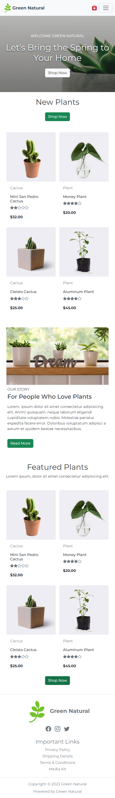

# Plants_Store_Site
* 주제 : Bootstrap을 이용한 식물 쇼핑몰 반응형 사이트입니다.
* 제작 기간 : 2023.01.27 ~ 2023.02.01 (5일)
* 기여도 : 퍼블리싱 
* 사용 스택 : Bootstrap, HTML5, CSS3 
* 기획의도 :  
프론트엔드 프레임워크인 부트스트랩의 큰 특징으로 반응형, 그리드, 다양한 컴포넌트를 제공하여 편의성이 있다는 점이 크게 다가와 부트스트랩을 이용하여 반응형 웹 페이지를 기획하였습니다.
* 결과물 :  
  <table>
    <tr>
      <th>PC</th>
      <th>Mobile</th>
    </tr>
    <tr>
      <td></td>
      <td></td>
    </tr>
  </table>
   
* 느낀점 : 부트스트랩은 다양한 컴포넌트를 제공하여 쉽고 빠르게 제작을 할 수 있었으나 아무래도 정형화된 디자인이 많아 원하는 기능을 넣고 싶을 때는 시간이 더 소요된다는 점을 배웠습니다. 그리고 미리 정의된 클래스를 하나하나 분석하고 많은 실습으로 익숙하게 사용하기까지 초기엔 시간 투자를 많이 해야 함을 느꼈습니다.
* 출처 : websitedemos site에서 디자인, 이미지 사용
<!--* URL :--> 
